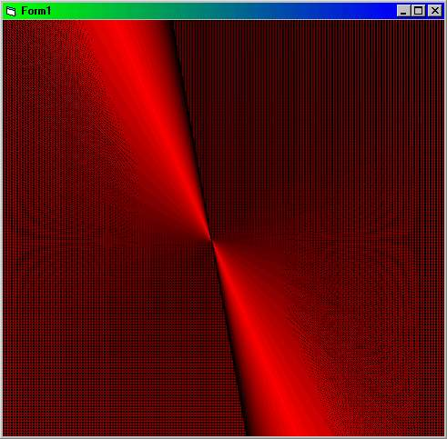

<div align="center">

## It's amazing what you can do with lines\!


</div>

### Description

This code draws something wierd...but cool! Lines rules! =)
 
### More Info
 
two timers called 'timer1' and 'timer2' and interval : 1, scalemode : pixel, Backcolor : black


<span>             |<span>
---                |---
**Submitted On**   |
**By**             |[ReXz](https://github.com/Planet-Source-Code/PSCIndex/blob/master/ByAuthor/rexz.md)
**Level**          |Beginner
**User Rating**    |4.3 (13 globes from 3 users)
**Compatibility**  |VB 5\.0, VB 6\.0
**Category**       |[Graphics](https://github.com/Planet-Source-Code/PSCIndex/blob/master/ByCategory/graphics__1-46.md)
**World**          |[Visual Basic](https://github.com/Planet-Source-Code/PSCIndex/blob/master/ByWorld/visual-basic.md)
**Archive File**   |[](https://github.com/Planet-Source-Code/rexz-it-s-amazing-what-you-can-do-with-lines__1-22046/archive/master.zip)

### API Declarations

Dim Color As Integer, lx2 As Integer, lx1 As Integer


### Source Code

```
Private Sub Form_Load()
lx2 = Me.ScaleWidth
Color = 0
End Sub
Private Sub Timer1_Timer()
Color = Color + 1
If Color < 255 Then
Me.ForeColor = RGB(Color, 0, 0)
lx1 = lx1 + 3
lx2 = lx2 - 3
Me.Line (lx1, Me.ScaleLeft)-(lx1, Me.ScaleWidth)
Me.Line (lx2, Me.ScaleWidth)-(lx2, Me.ScaleLeft)
Me.Line (0, lx1)-(Me.ScaleWidth, lx1)
Me.Line (Me.ScaleHeight, lx1)-(Me.ScaleTop, lx2)
ElseIf Color > 254 Then
Timer1.Enabled = False
Timer2.Enabled = True
End If
End Sub
Private Sub Timer2_Timer()
Color = Color - 1
If Color > 1 Then
Me.ForeColor = RGB(Color, 0, 0)
lx1 = lx1 + 3
lx2 = lx2 - 3
Me.Line (lx1, Me.ScaleLeft)-(lx1, Me.ScaleWidth)
Me.Line (lx2, Me.ScaleWidth)-(lx2, Me.ScaleLeft)
Me.Line (0, lx1)-(Me.ScaleWidth, lx1)
Me.Line (Me.ScaleHeight, lx1)-(Me.ScaleTop, lx2)
ElseIf Color < 1 Then
Timer2.Enabled = False
End If
End Sub
```

